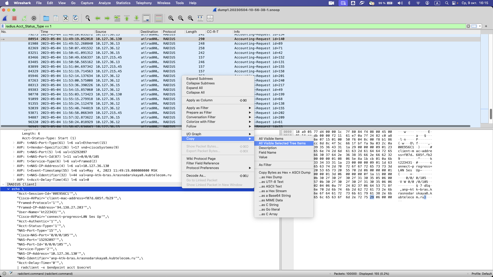
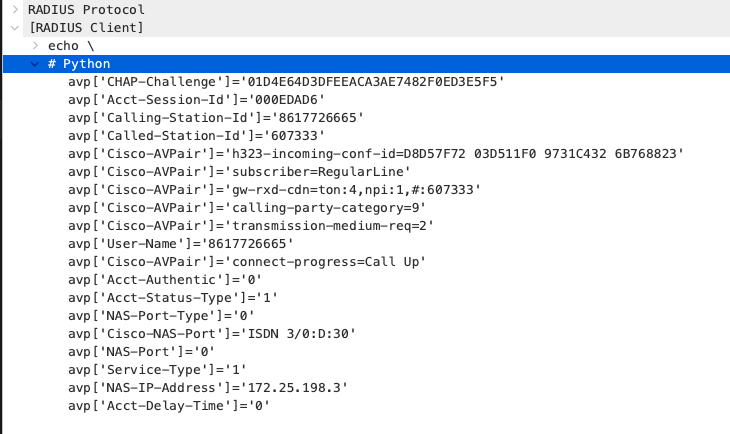

# wireshark-radius-radclient

## install

Put [radius-radclient.lua](radius-radclient.lua) in Wireshark plugins folder
* windows: %APPDATA%\Wireshark\plugins
* linux: ~/.local/lib/wireshark/plugins

## use

### radclient
Copy radius message as rad client command like this:

### python
Copy radius message avp to test code:

